# ai-control

**让 AI 编程助手在你的项目里守规矩的工具。**

你在用 Cursor、Claude Code、Codex、通义 Qoder、字节 Trae 这些 AI 写代码时，是不是遇到过：

- AI **编造**了一个数据库里根本不存在的字段？
- AI 说"测试通过了"，其实**根本没跑**测试？
- AI **顺手执行**了一条危险 SQL，或者把不该动的表改了？
- 想管住它，结果流程太重，改个文案也要走一堆步骤，最后**自己都不想守**？

ai-control 就是治这四件事的：装进你的项目后，AI 会**先写变更单给你确认、动数据库前必须等你点头、测试结果以测试报告为准（说了不算）**——而改文案这类小事走 30 秒的快速通道，不折腾你。

## 安装（动画演示）

<p align="center">
  
</p>

三条命令：装工具、装进项目、给六个 AI 工具（Claude Code / Codex / Qoder / Trae / Cursor / WorkBuddy）写入钩子与适配物——装完即用，六个都原生读 `AGENTS.md`。**想同步看一个真实需求怎么走完整流程 → 打开 [`docs/demo.html`](docs/demo.html)**（自包含单页，clone 后双击即可，含逐步动画、六条门禁拦截的真实输出，以及确认留痕的两条路径）。

## 效果对比

```text
❌ 没装之前
你：加个订单导出功能
AI：好的！（编了个 status=5 的枚举值，顺手改了表结构，最后说"测试全部通过"）
你：……上线炸了。

✅ 装了之后
你：加个订单导出功能
AI：我先看了代码。这个需求要动 t_order 表，属于高风险变更。
    这是变更单：改什么、动哪张表、验收标准是这 4 条测试用例。确认吗？
你：确认
AI：（实现 → 跑测试）测试报告 4 条全绿，ai ship 发布检查通过。表结构变更的回滚 SQL 在这里。
```

你全程只做两件事：**确认变更单、确认数据库改动**。其他检查（用例覆盖没覆盖、测试报告在不在、有没有失败）由内置的自动检查完成——它查的是测试框架生成的原始报告，AI 想蒙混就得伪造报告文件，成本高得多、也容易被发现。

> 上面这段对话不是编的：完整实录（真实命令输出 + 逐步动画）在下面「[一个真实需求走一遍](#一个真实需求走一遍订单列表加导出-csv)」。

## 3 分钟上手

```bash
# 1. 装工具（一次性）
npm install -g @brightliu/ai-control
# 网络装不了 npm 官方源时的备选：npm install -g github:BrightLiu4917/ai-control

# 2. 装进你的项目
cd 你的项目
ai init                  # 自动识别技术栈；也可指定 --stack java|go|php|vue|react|node|mixed
ai sync                  # 只有用 Claude Code / WorkBuddy 才需要：为它们生成各自格式的配置文件

# 3. 开始干活——两种用法任选
```

**用法 A（推荐）：在 AI 工具里说人话。** 直接提需求，AI 会自己执行下面这 5 个命令并替你补全变更单——你只负责在确认点点头。用法 B 是同一套流程的手动入口，两者随时混用。

**用法 B：终端命令。** 一共 5 个：

| 命令 | 干什么 | 人话 |
|---|---|---|
| `ai new 名字` | 生成变更单骨架（需求说明 + 验收用例两个文件，由 AI 补全内容、你来确认） | "我要开工了"（小事加 `--lite`） |
| `ai check 名字` | 检查变更单写全没有 | "能给用户确认了吗" |
| `ai confirm 名字` | 留下确认记录（谁、何时、哪个提交、**变更单内容哈希、确认来源**）。终端里你自己敲；GUI/app 里回一句"确认"，AI 用 `--attested` 代记（留痕如实标注来源） | "我确认了"（ship 的前置） |
| `ai test 名字` | 跑你项目自己的测试，报告自动按变更隔离存放 | "跑测试" |
| `ai ship 名字` | 核对测试报告：确认过没有、报告新不新、全绿没有 | "能交付了吗"（秒级出结果） |

## 完整流程（一张图看懂）

```text
                                你对 AI 说需求
                                       │
                        AI 先看代码，判断这事有多大
                                       │
      ┌──────────────────┬────────────┴───────────┬──────────────────────┐
      ▼                  ▼                        ▼                      ▼
【改错别字级】      【小需求 lite】            【正常需求】           【要动数据库】
 改注释/文档/typo   改文案、调样式             新功能、改接口          加字段、建表、迁移
      │                  │                        │                      │
   直接改完          AI 建变更单                AI 建变更单            完整流程再多一步：
   不走流程          （2 个文件）              （3 个文件）           AI 先给表结构设计
      │                  │                        │                   → 你点头 → 再给
      │                  └──────────┬─────────────┘                   变更包（SQL+回滚）
      │                             ▼                                 → 你再点头才许执行
      │              ①【确认点】看变更单：改什么、                              │
      │                动哪些文件、验收标准是哪几条用例                          │
      │                             │                                        │
      │              你说"确认"，然后二选一（终端你敲 / 对话里 AI 代记）：      │
      │        ai confirm 变更名   或   ai confirm 变更名 --attested  ◄───────┘
      │        （留痕：谁、几点、哪个提交、变更单哈希、来源 cli / ai-attested）
      │                             │
      │                      AI 开始写代码
      │            （确认之前它想写一行业务代码都会被钩子拦住）
      │                             │
      │                      ai test 变更名
      │            （跑你项目的测试，报告自动按变更隔离存放）
      │                             │
      │                      ai ship 变更名
      │       ┌─────────── 秒级自动核对 4 件事 ────────────┐
      │       │ ① 确认过没有？确认后变更单被偷改过没有？      │
      │       │ ② 测试报告在不在？是不是本次新跑出来的？      │
      │       │ ③ 有没有挂掉的测试？                        │
      │       │ ④ 每条用例在报告里有没有通过记录？           │
      │       └────────┬──────────────────┬───────────────┘
      │            全过 ✅             有一条不过 ❌
      ▼                │                  │
    完事               ▼                  ▼
              交付（动过库的附回滚 SQL）   AI 回去补，修好重新 ship
```

你全程只干三件事：**提需求 → 看变更单点头 → 等结果**（终端里敲 `ai confirm`；GUI/app 里回一句"确认"即可）。按事情大小分流：

| 事情多大 | 例子 | 流程 | 你花几分钟 |
|---|---|---|---|
| 芝麻 | 错别字、注释 | 没有流程，直接改 | 0 |
| 小 | 改文案、调样式 | lite：2 个文件，看一眼确认 | ~30 秒 |
| 中 | 新功能、改接口 | 完整：3 个文件 + 自动化测试 | 2~5 分钟 |
| 大 | 动数据库 | 完整 + 数据库两次点头 + 建议独立审查 | 5~10 分钟 |

AI 以"小需求"开工、中途发现要动表或接口？门禁直接拦下、强制升级完整流程——**快速通道不是逃生通道**。

## 一个真实需求走一遍：订单列表加「导出 CSV」

下面每条命令输出都是真跑出来的（演示项目 `order-center`，Java / Spring Boot + Vue）。逐步动画与完整六段门禁实录见 [`docs/demo.html`](docs/demo.html)。

**需求**：运营每月对账要按客户 + 日期区间导出订单，现在只能用列表页一页页翻（每页 20 条）。

**① AI 先看代码，不是先写代码。** 影响探测结果：触碰 `OrderController` / `OrderService` / `OrderMapper.xml` / `OrderListView.vue`，新增 `GET /api/orders/export`，并要给 `t_order` 加复合索引 `idx_tenant_created` → 按判级规则这是**完整流程 + 数据库两阶段确认**。

**② `ai new order-export-csv` 建骨架**（proposal + test-cases + specs 三件套）。骨架里留了 4 个必答问题；AI 要是装没看见就想去拿确认：

```text
$ ai check order-export-csv
[FAIL] 待确认问题未答（proposal.md）: 访问控制：本功能的权限要求是什么？
[FAIL] 待确认问题未答（proposal.md）: 数据表：涉及哪些表/字段/索引？（涉及则必须走数据库两阶段确认）
[FAIL] 待确认问题未答（proposal.md）: API 契约：路径、请求、响应、分页、错误码？（遵循 rules/20-api.md）
[FAIL] 待确认问题未答（proposal.md）: 验收标准：最小可验证路径、失败路径、越权场景分别是什么？
[FAIL] check 未通过（4 项）
```

**③ 补齐后 check 通过，AI 递上确认单**：级别、判级理由、改什么、非目标、影响范围（文件 / 表 / 接口 / 页面）、5 条验收用例（TC-01 正常流 · TC-02 异常流 · TC-03 边界 · TC-04 权限 · TC-05 空态）。

**④ 确认留痕**——终端里你自己敲（`source: cli`）；GUI/app 里回一句"确认"，AI 代记 `--attested`（`source: ai-attested`）：

```text
$ ai confirm order-export-csv
CONFIRM_OK：已留痕（by=liuweiliang）。开始实现；proposal/test-cases 再改动需重新确认。

$ ai confirm order-export-csv --attested      # 你在对话里已同意，AI 代记
CONFIRM_OK：已留痕（by=liuweiliang）。开始实现；proposal/test-cases 再改动需重新确认。
来源：ai-attested（AI 代记）——留痕据此标注，门禁强度不变。
```

**⑤ 数据库两阶段确认**：先确认索引设计（为什么是 `(tenant_id, created_at, customer_id)`），再确认变更包——目标 DDL、回滚 SQL、联动清单一起来：

```sql
-- V20260917__idx_order_tenant_created.sql
CREATE INDEX idx_tenant_created ON t_order (tenant_id, created_at, customer_id);
-- 回滚：DROP INDEX idx_tenant_created ON t_order;
```

**⑥ 实现 → 跑测试 → 交付**：

```text
$ ai test order-export-csv
==> mvn test
[INFO] Running com.example.order.OrderExportServiceTest
[INFO] Tests run: 4, Failures: 0, Errors: 0, Skipped: 0
已把 1 份新报告收入 test-results/order-export-csv/（按变更隔离）
TEST_PASSED（JUnit 报告即验收证据，ai ship 时核对）

$ ai ship order-export-csv
EVIDENCE_OK：报告 1 份，非手动用例 4 条全部有通过记录。
提示：本变更涉及数据库，建议在新会话用 .ai/templates/review-prompt.md 做一次独立审查。
SHIP_GATES_PASSED：门禁全部通过（已写入 shipped.json）。
```

**你在这个需求里只做了两件事**：看一眼确认单说"确认"（约 2 分钟）、数据库两次点头（约 3 分钟）。用例覆盖够不够、报告在不在、有没有失败、有没有密钥——都是命令在查。

**门禁实际拦下来的四种情况**（均为真实输出，完整六段见 [`docs/demo.html`](docs/demo.html)）：

| 场景 | 拦下时说的话 |
|---|---|
| 还没确认就想交付 | `[FAIL] 变更未确认：向用户输出确认单。终端里由用户敲 ai confirm order-export-csv；GUI/app 场景…代记 ai confirm order-export-csv --attested` |
| 确认后又偷改变更单 | `[FAIL] 确认已过期：proposal/test-cases/specs 在确认后被修改` |
| 拿确认之前的旧报告顶包 | `[FAIL] 测试报告早于本变更的确认时间——疑似旧报告` |
| lite 变更里夹带接口改动 | `[FAIL] lite 变更不允许涉及 API 契约；运行 ai new … --upgrade 升级为完整流程` |

## 它靠什么管住 AI（三层，由软到硬）

1. **规矩**（`AGENTS.md` + `.ai/rules/`）：63 行契约每次对话自动生效 + 20 份中文工程规则按需加载——禁止编造字段、SQL 必须带 WHERE、枚举必须 code+desc 禁止魔法值、JOIN 不许先连后分页……**这些是踩过生产事故总结的具体规则，不是"请写好代码"式的空话**。
2. **确认点**（必须等你点头的两处）：变更单确认之前 AI 不许写码——你点头后 `ai confirm` 会记下确认人 / 时间 / 提交号 / 变更单内容哈希 / **确认来源**（`cli` 你敲的 · `ai-attested` AI 代记），之后变更单再被改动确认即失效；数据库改动确认之前 AI 不许执行 SQL。
   > 关于这一层的诚实说明：**"必须你本人敲"在本地无法强制**——AI 有 shell 权限，真想绕总绕得过（比如关掉钩子）。但钩子把两条伪造路径都堵上了：**冒充你敲**（不带 `--attested` 的 `ai confirm`）会拦，**手写 `confirmed.json` 伪造留痕**也会拦。AI 想让流程往下走，就只能走 `--attested` 如实代记，留痕写成 `ai-attested`——你在 `ai ship` / `ai doctor` 里一眼能看见。**门禁强度跟来源无关**（`ship` 判定一视同仁），区别只在诚实不诚实。
3. **自动检查**（内置在 check/confirm/ship 命令里的程序）：变更单声明动表却想走快速通道？拦。碰表/接口却全是手动用例？拦。没确认就想交付、或确认后偷改了变更单？拦。测试报告缺失、有失败、或比确认时间还旧（拿旧报告顶包）？拦。（数据库确认属于第 2 层——靠契约约束 AI 停下等你，ship 时会提示做独立审查，不是机械拦截。）

## 支持哪些 AI 工具

`ai sync` 一次，**六个工具都能拿到机械拦截**。它们的 PreToolUse 钩子协议互通（stdin 收 `tool_input`、`exit 2` 阻断并把原因回传给模型），所以装的是**同一份守卫脚本**，只是各写一份自己的配置文件：

| 工具 | `ai sync` 写入 | 拦截 | 会话工牌 |
|---|---|---|---|
| Claude Code | `.claude/settings.json` · `CLAUDE.md` · `.claude/agents` · `.claude/skills` | ✅ | ✅ |
| WorkBuddy | `.workbuddy/settings.json` · `.workbuddy/skills/` | ✅ | ✅ |
| Codex | `.codex/hooks.json` | ✅ | ✅ |
| Qoder | `.qoder/settings.json` | ✅ | ✅ |
| Trae | `.trae/hooks.json` | ✅ | — |
| Cursor | `.cursor/hooks.json` | ✅ | — |

（Trae / Cursor 暂不装会话工牌：它们的 SessionStart 输出契约未确认，不冒"把 JSON 当纯文本塞进上下文"的风险。只想装其中几个：`ai sync --tools=claude,codex`。）

装上钩子后，这些动作在**动手的一瞬间**被拦下，而不是事后提醒：未确认变更就写业务代码、写影响范围外的文件、危险 SQL（`DROP` / `TRUNCATE` / 无 WHERE 的 `DELETE`）、冒充你敲 `ai confirm`、手写 `confirmed.json` 伪造留痕。

**各工具的生效条件不同**：

| 工具 | 装完要做什么 |
|---|---|
| Claude Code | 新开会话即生效 |
| WorkBuddy | **Cmd+Q 完全重启**（关窗不算——配置在启动时缓存） |
| Codex | 在 `config.toml` 开 `[features] codex_hooks = true`，并在 `/hooks` 里信任本项目钩子 |
| Trae / Qoder / Cursor | 重开 IDE 或新开会话 |

多语言混合项目（如 Java 后端 + Vue 前端）装一次即可：AI 按任务碰到的文件自动选对应规则；测试命令在 `.ai/config.json` 里配一条串联命令。六个工具都原生读 `AGENTS.md`，规则部分不依赖钩子。

**确认这一步在所有工具里都能用**——两条路，门禁强度完全相同（`ai ship` 判定一视同仁），差别只在留痕怎么写：

| 你在哪 | 怎么确认 | 留痕写入 |
|---|---|---|
| 终端 | 自己敲 `ai confirm <id>` | `source: "cli"` |
| 任意 AI 工具里 | 回一句"确认"，AI 代记 `ai confirm <id> --attested` | `source: "ai-attested"` |

而"冒充你敲"（不带 `--attested`）在**六个工具里都会被当场拦下**，并回显真实变更名让你复制。

升级到本版本的已有项目，跑一次 `ai sync --force` 即可拿到六个工具的钩子。

## 装进项目后长什么样

```text
你的项目/
├── AGENTS.md            规矩总纲——六个 AI 工具都自动读取
├── .ai/                 规则库、角色手册 + changes/（变更单记录，每个需求一个文件夹）
└── 各工具配置（ai sync 生成，建议入库、团队共享）
    ├── .claude/         Claude Code：钩子 + subagent + 技能（另有 CLAUDE.md 入口）
    ├── .workbuddy/      WorkBuddy：钩子配置 + 项目级技能
    └── .codex/  .qoder/  .trae/  .cursor/    各自一份钩子配置
```

已有 AGENTS.md 的项目不会被覆盖；升级用 `ai init --update`（只更新框架文件，先自动备份，绝不碰你的变更记录）。

## 你怎么知道它真的在用

三层，都是本机、离线、可关。

**1. 每条命令一行工牌**（装完就有）——版本、本次命令、本机累计调用次数：

```text
◆ bright-ai-coding · ai-control v2.3.0 · ai ship · 本机第 37 次
```

人在终端里看是彩色的；脚本、CI、AI 工具调用时它自动改走 **stderr**，stdout 的机器契约不受影响。关掉：`AI_CONTROL_QUIET=1` 或项目 `.ai/config.json` 里 `"banner": "off"`。

**2. 每次开新会话都打卡。** `ai sync` 会装一个 `SessionStart` 钩子：新开会话（以及 `/clear`、恢复、压缩后）打一行工牌，并把"本项目有哪些进行中变更"注入上下文——AI 一上来就知道自己在受管项目里，不用你提醒。Claude Code、WorkBuddy、Codex、Qoder 都装了这一个。

```text
◆ bright-ai-coding · ai-control v2.3.0 · 本项目受管控 · 进行中变更 1 个（list-empty-hint）
```

Trae / Cursor 看不到这行（它们的 SessionStart 输出契约未确认，暂未装；Kimi 只读 `AGENTS.md`）——但这不影响流程：这些工具的**拦截类钩子是装了的**，而且它们推进流程时必须调用 `ai check / test / ship`，那些调用一样进账本。

**3. `ai stats`：把账本读成答案。**

```text
◆ bright-ai-coding · ai-control v2.3.0 · ai stats

本机使用记录（只在 ~/.ai-control/usage.jsonl，不联网、不上报；AI_CONTROL_USAGE=off 可关）
  首次使用  2026-09-16 14:06（累计 128 次，最近 7 天 41 次）
  非零退出  9 次（门禁拦截或失败；最近 7 天 3 次）
  最近一次  2026-09-17 14:37

  按命令    ai ship 32 · ai test 28 · ai new 24 · ai check 21 · ai confirm 18 · ai sync 2
  按项目    order-center 76 · bright-xtl 31 · flu 21

  最近
    09-17 14:37  ai sync   -                  ✓         order-center
    09-17 14:25  ai ship   order-export-csv   ✓         order-center
    09-17 14:13  ai ship   order-export-csv   ✗ exit=2  order-center

本项目（order-center）
  变更      进行中 1 个 · 已交付 1 个
  钩子拦截  1 次（最近 2026-09-17 14:37）——AI 想越界被当场按住

说明：这里统计的是 ai 命令被调用的次数与结果，不统计 AI 工具内部的每一次工具调用（那属于工具自己的日志）。
```

**「钩子拦截」才是最有说服力的那个数字。** 它记的是 AI 想越界被当场按住的次数——未确认就写业务代码、写影响范围外的文件、危险 SQL、不带 `--attested` 代跑 `ai confirm`、手写 `confirmed.json` 伪造留痕——落在项目里的 `.ai/interceptions.jsonl`（已写进 .gitignore，不入库）。**六个装了钩子的工具都会记账**。调用次数说明"有人跑过"，拦截次数说明"它真的拦下过东西"。

`ai doctor` 里也顺带带上了使用量、拦截数，以及"项目里的框架文件比 CLI 落后几个版本"（升级用 `ai init --update`）。

隐私与关闭：日志只写本机 `~/.ai-control/usage.jsonl`，**不采集代码内容、不发任何网络请求**；超过 1MB 只保留尾部 2000 条。`AI_CONTROL_QUIET=1` 只关工牌；`AI_CONTROL_USAGE=off` 或项目 `.ai/config.json` 里 `"usage": "off"` 连记录一起关。

## 高风险变更想要第二意见？

`ai ship` 检测到动数据库/支付/状态流时会提示：新开一个 AI 会话，用 `.ai/templates/review-prompt.md` + git diff 让它做一次独立审查（审查者不能是写代码的那个会话）。零配置、零 API 费用。

## 常见问题

**Q：改个错别字也要走流程吗？**
不用。纯文档/注释/typo 直接改；小功能走 `--lite`（两个文件、30 秒确认）；只有动数据库、接口、权限才走完整流程。管控力度和风险成正比。

**Q：AI 不守规矩怎么办？**
说一句"按控制系统流程来"即可拽回；关键环节（越级偷渡、报告缺失或有失败、diff 含密钥）有自动检查兜底。诚实说明三条边界：① AI 理论上可伪造报告文件——门禁把"张嘴谎报"变成"必须留下可查的假证据"，成本和暴露风险不是一个量级；② 门禁验证"有叫这个名的通过测试"，验证不了测试写得好不好（空壳测试查不出来）——高风险变更的独立审查就是为这个准备的；③ 整套流程的启动键在 AI 手里，它压根不进流程时只有契约文字在管——所以契约做成每次对话自动加载，你发现不对说一句就能拽回。

**Q：测试报告是什么格式？**
JUnit XML——`ai test` 会按栈自动搞定：Maven 自带；Go 的输出自动转成报告（零配置，无需 gotestsum）；Vitest 自动注入内置 junit reporter；PHPUnit 自动加 `--log-junit`；仅 Jest 需要 `npm i -D jest-junit`（会提示）。测试方法名里带上用例编号（如 `test_TC01_xxx`）即可被核对。多变更并行时把报告输出到 `test-results/<变更名>/` 可互相隔离；报告必须比确认时间新——旧报告顶包会被拦下。

## 被脚本 / Agent 调用？机器契约在这

所有命令遵守统一约定，无需解析人类文案：**退出码** 0=通过、1=用法或环境错误、2=门禁拦截；**结果信号**固定为输出中的单行大写标记：`CHECK_PASSED` / `CONFIRM_OK` / `TEST_PASSED` / `SHIP_GATES_PASSED` / `DOCTOR_OK`（失败时为 `[FAIL] ...` 行 + 非零退出码）。这两样是稳定接口，不会随文案调整而变。给你看的工牌（`◆ bright-ai-coding …`）在非 TTY 时走 stderr，所以按 stdout 解析永远是干净的。

## 团队用？把门禁挂到 PR 上

个人用时门禁跑在本地；团队用时加一个 GitHub Action，PR 不合规直接挂红叉合不了：

```yaml
# .github/workflows/ai-gates.yml
name: ai-gates
on: pull_request
jobs:
  gates:
    runs-on: ubuntu-latest
    steps:
      - uses: actions/checkout@v4
      - uses: BrightLiu4917/ai-control@main          # 契约门禁（check）
      # 需要证据门禁时：先跑你的测试产出 JUnit 报告，再加一步
      # - uses: BrightLiu4917/ai-control@main
      #   with: { mode: ship }
```

## 工程质量

零运行时依赖（只需 Node ≥18.17 + git）；26 个端到端验收测试 + 8 个单元测试 + 规则库引用自检（防悬空引用）；代码量硬预算写进 CI（内核 ≤1500 行、契约 ≤100 行、文档 1 份），超支即红——防止工具本身变臃肿。

前身 [ai-coding-fun](https://github.com/BrightLiu4917/ai-coding-fun)（v1）经 15 批真实项目迭代后彻底重构：5000 行 bash → 600 行 JS，五份文档的流程 → 两份，学习成本压缩到本 README 一页。
